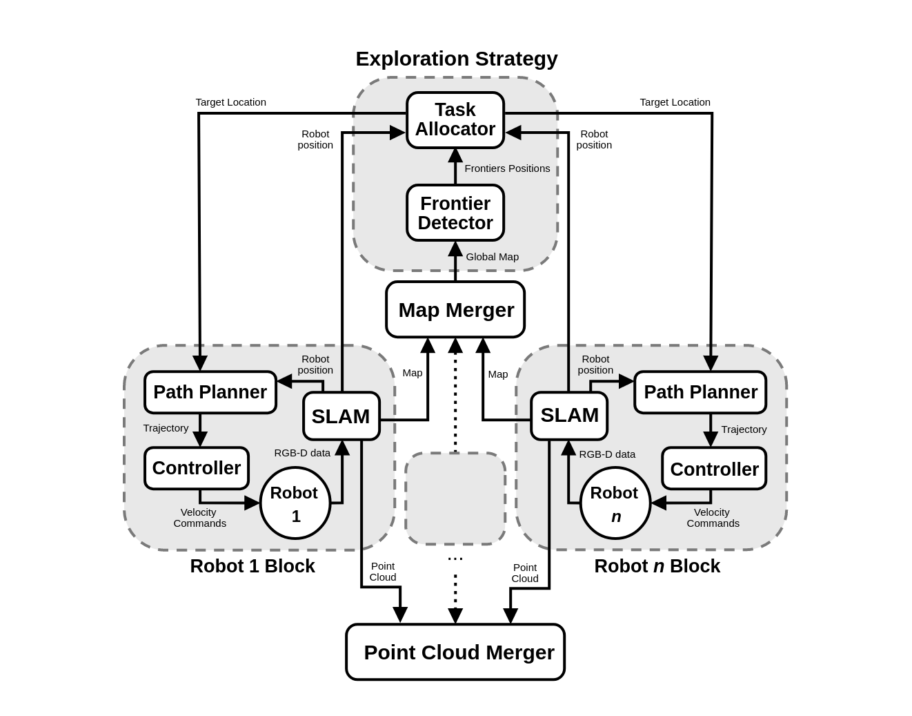
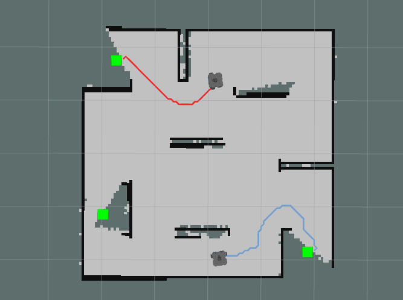

# Multirobot Exploration and Mapping

## Project Overview:
Final project of the course "Design Methods for Unmanned Vehicles" of University of Trento.

The work aims at achieving autonomous exploration and mapping in an unknown environment by deploying multiple robots, each equipped with an RGB-D camera. The project has been developed as a ROS (Noetic) package, developed in Python3. Turtlebot was used as robot model, but the core can be easily deployed to other models.

General scheme of the simulation:

<p align="center" display="inblock">
 
</p>

The solution of the SLAM problem and point-cloud re-construnction is handled by RTAB-Map, by [IntRoLab](https://github.com/introlab). This is done for each robot, and the resulting maps are fed into a map marger, which generates a global map of the environment. 

A OpenCV-based frontier detector identifies the regions to be explored in the map. 
<p align="center" display="inblock">
 
</p>

A task manager assigns the frontiers to the individual robots, following a precise exploration strategy. An improved version of the A* algorithm (based on the _Fast Marching Method_) is used for path planning, and it ensures obstacle avoidance with good clearance. 
<p align="center" display="inblock">
 
</p>

When all frontiers are explored, all robots go back to the initial position. In post-processing, the point-clouds generated by the single robots are merged to obtain a final one.

## Installation Steps:

### _ROS Version_ and _OS_: Noetic on Ubuntu 20.04

Install ROS Noetic:

```bash
sudo apt update
sudo sudo apt install ros-noetic-desktop
```
Source the ROS environment:
```bash
echo "source /opt/ros/noetic/setup.bash" >> ~/.bashrc
source ~/.bashrc
```
Make sure that _Gazebo_ and _Rviz_ are installed:
```bash
sudo apt-get install ros-noetic-gazebo-ros-pkgs ros-noetic-gazebo-ros-control
sudo apt-get install ros-noetic-rviz
```

### Python 
Install Python 3.8 with the following command:
```bash
sudo apt install python3.8
sudo apt install python3-pip
```
Install the required packages:
```bash
pip3 install numpy opencv-python numba scikit-fmm
```

### Create ROS Workspace
Create the **catkin_ws** workspace:

```bash
mkdir -p ~/turtle_ws/src
```

**Clone** the project repository in the "src" folder:
```bash
cd ~/turtle_ws/src
git clone https://github.com/matteomastrogiuseppe/Multirobot-Exploration-and-Mapping
```

**Build** the workspace and packages:
```bash
cd ~/turtle_ws
catkin_make
```

Remember to **source** this workspace by editing the .bashrc file:
```bash
echo "source ~/turtle_ws/devel/setup.bash" >> ~/.bashrc
source ~/.bashrc
```

### Install Dependecies:
For a first development, the `TurtleBot` environment was used. Follow the ufficial procedure at [Gazebo Simulation](https://emanual.robotis.com/docs/en/platform/turtlebot3/simulation/#gazebo-simulation), or simply install via Debian.
`RTAB-Map` was used for solution of SLAM and mapping.
`multirobot_map_merge` was used to merge the robot individual maps.
```bash
cd ~/turtle_ws/src
git clone -b noetic-devel https://github.com/ROBOTIS-GIT/turtlebot3_simulations
git clone -b noetic-devel https://github.com/ROBOTIS-GIT/turtlebot3
git clone -b noetic-devel https://github.com/introlab/rtabmap_ros
git clone -b noetic-devel https://github.com/hrnr/m-explore/tree/noetic-devel/map_merge
cd ~/turtle_ws/
catkin_make
```

## Run the project

To run the simulation:

```bash
roslaunch multi_explore multi_explore.launch
```

The global map generally spawns after 20 seconds in ROS time, because of the map merger initial overhead. The first run will take more time, because some functions will be compiled in machine code through the _Numba_ library. After the first run, everything is stored in the cache, so no need to wait for the compilation at every launch.

Final point-cloud is stored into a `.db` database file. n order to obtain the final Point Cloud run the following module in a bash terminal 

```bash
rtabmap-databaseViewer
```
Import the .db file, and export the final point-cloud as a .ply file.
